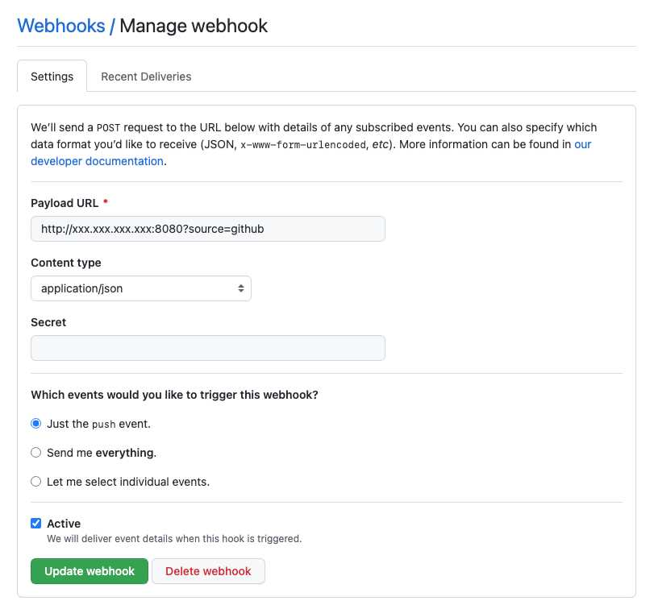
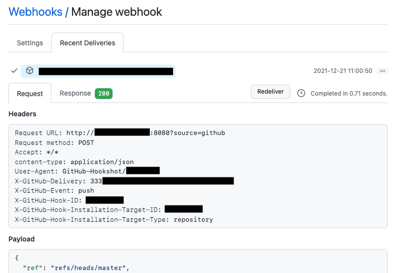
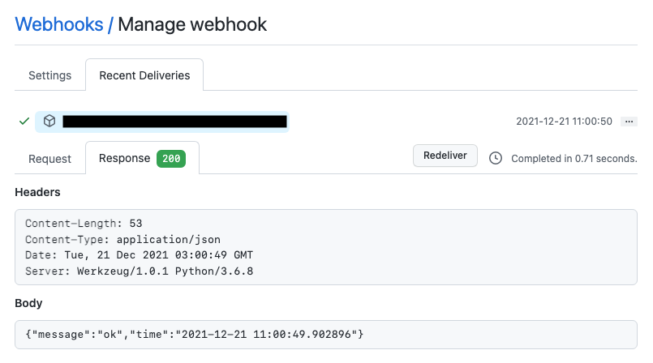

# _HookReposter_

> 简洁的webhook转发设计与实现。


</img>

## 使用方式

&#160; &#160; &#160; &#160; 1、修改`config.json`中的配置项，修改部署IP和端口。

&#160; &#160; &#160; &#160; 2、修改`repost_rules.json`中的配置项，其中一些参数项是必须的，下面对其进行说明：

参考`repost_rules.json.tmplt`文件：

&#160; &#160; &#160; &#160; `"github"`表示向部署机器发送请求的标识。这个需要在预留`webhook`到第三方时设定`url`参数`source`的值为这个标识串。举例来说，在`GitHub`的`Webhook`预留的地址就是`http://domain?source=github`。

&#160; &#160; &#160; &#160; `parse`表示需要从收到的数据中进行解析的内容。结合`github.example.json`可知，每个字段表示的具体解析内容。对于每个`map`的(嵌套)字段，通过`.`来标识。如果某个字段是一个数组，那么解析得到的内容也将是一个数组。这种情况可以参考其中的`commit_modified`的解析内容。**这部分内容也是核心内容之一，即"如何通过一种简易直观的方式(这里的标识解析字段的串)，实现从数据中解析获取特定的内容"**。

&#160; &#160; &#160; &#160; `hosts`标识将解析的数据转发的目标，其中必须的字段是`url`、`method`以及`data`。下面逐个说明相应字段的含义：

&#160; &#160; &#160; &#160; `url`就是需要转发到的地址，通常是另一个`webhook`。

&#160; &#160; &#160; &#160; `method`就是请求的方式，暂未支持`GET`方式。且目前的测试场景均为`POST`+`json`的方式。

&#160; &#160; &#160; &#160; `data`就是要转发的数据，这里定义转发的数据格式。很多情况下的数据都是一个`json对象`，所以这里就直接将`data`设定为一个此类型。对于这个数据内的每个字段(无论是否层级嵌套)，都会尝试进行解析替换。如果某个字段值的类型为`字符串`类型，那么就会尝试匹配其中的内容是否已经出现在`parse`中已解析得到的结果，发现已有解析内容，则直接进行字面值替换。

&#160; &#160; &#160; &#160; 这里对替换的标识格式有限制，如果是一个普通字段值，需要用`${`+`}`来界定；如果是一个数组，则需要用`$[`+`]`来界定。对于数组内容，可能数组内的元素是一个“结构体”，那么会将每个出现在解析值前的字符串常量作为其名称，拼接到每个元素值上。这里可以参考示例中的`data.markdown.content`字段的解析替换结果。

## 安装与运行

```bash
git clone git@github.com:Modnars/ModTools.git
cd ModTools/HookReposter/python
cp config.json.tmplt config.json
cp repost_rules.json.tmplt repost_rules.json
vim config.json repost_rules.json # 按照需求自定义设置
python3 reposter.py # or nohup python3 reposter.py &
```

## 示例

&#160; &#160; &#160; &#160; 应用场景: 监听GitHub的PUSH事件，当有人向指定仓库PUSH代码时，接收来自GitHub的请求，解析数据，转发指定内容给企业微信机器人webhook。

&#160; &#160; &#160; &#160; `GitHub`设置`webhook`地址: **注意需要填充`source`参数。**



&#160; &#160; &#160; &#160; 当发生`PUSH`事件时，`GitHub`会向webhook发送请求。



&#160; &#160; &#160; &#160; `GitHub`调用成功后，会显示收到的回包内容。



## 后续优化计划

- 优化发送方式: 目前是阻塞同步调用webhook，当注册的转发host较多时，会较为耗时，进而导致调用方超时。考虑使用异步方式来请求转发webhook，以免阻塞调用方。

- 支持更加丰富的数据类型: 目前还是更多地以字符串为核心内容，考虑到更加宽泛的应用场景，可能会需要更加丰富的数据类型支持。

## 声明

&#160; &#160; &#160; &#160; 遵从`MIT LICENSE`协议开源。

&#160; &#160; &#160; &#160; Copyright (c) 2021 ModnarShen.

